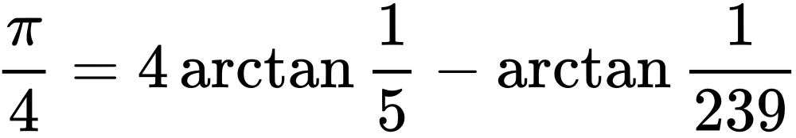
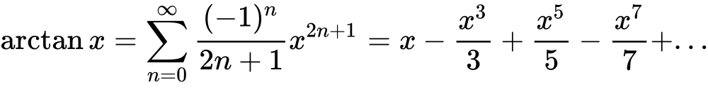

# PiApproximationAlgorithm
## An implementation of a Machin-like formula to approximate the digits of π.

## Implementation Explanation
### Long Version
A Wikipedia explanation of Machin-like formulas: [5head Wikipedia article](https://en.wikipedia.org/wiki/Machin-like_formula)

### Short Version
I used this formula for approximating π:

I used this formula for approximating arctan(x):

## Compilation
Literally just the command `make` in the project directory—pretty simple. Executables will be saved to `./build`.

## Binary Descriptions
`calcPi` I'm sure you can guess what this application does, but I'll tell you anyway. It approximates the value of π with the specified number of iterations and saves it to a file.

`extractDigits` You also can probably guess the purpose of this application too. It prints the specified digits of π from the rational fraction output of `calcPi` to STDOUT.

## Binary Usage
`calcPi <file path to save rational approximation of pi> <number of iterations to run for (higher number means more digits, but more computation time)>`

`extractDigits <file path to read rational approximation of pi> <number of digits to extract>`

 - I would suggest adding `<extractDigits command> > <some file>` if you don't want console spam.

